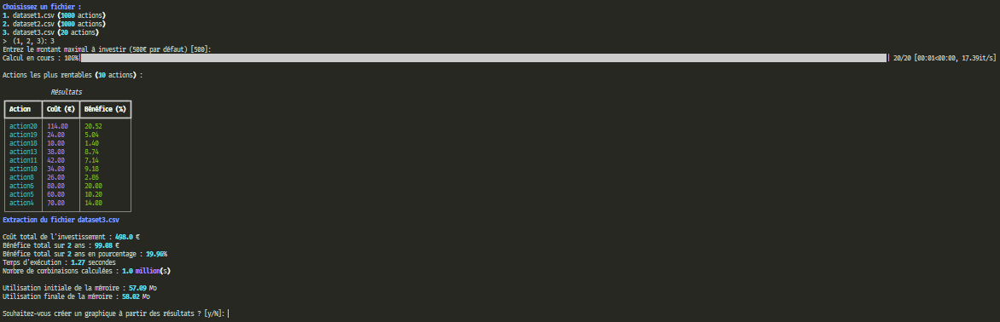
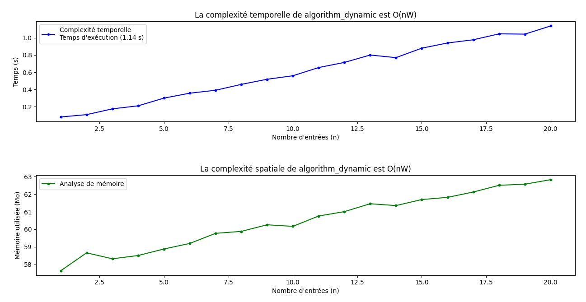
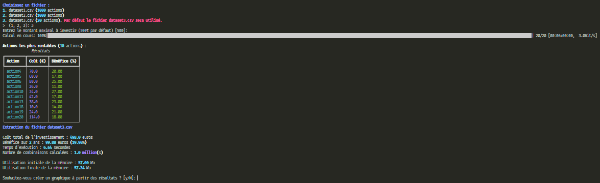
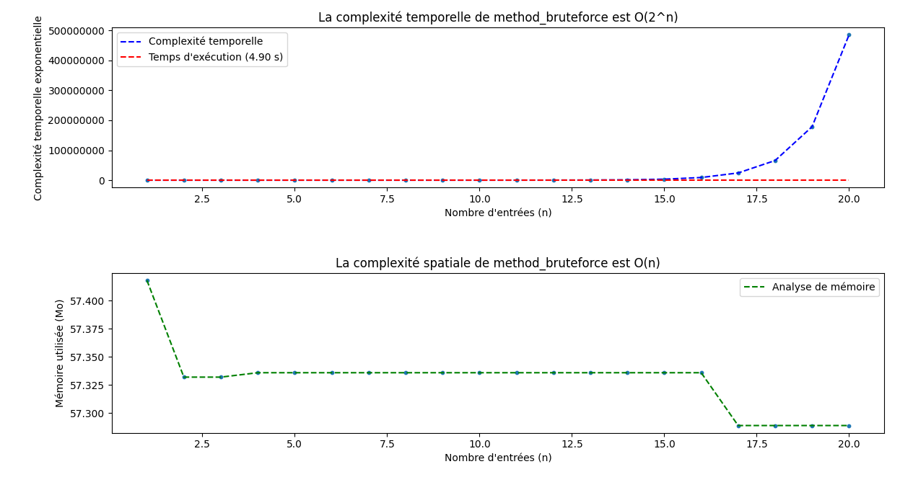

   
   
   

   

<div id="top"></div>

# Menu   
1. **[Informations générales](#informations-generales)**   
2. **[Liste pré-requis](#liste-pre-requis)**   
3. **[Création environnement](#creation-environnement)**   
4. **[Activation environnement](#activation-environnement)**   
5. **[Installation des librairies](#installation-librairies)**   
6. **[Exécution du programme](#execution-programme)**   
7. **[Lancement algorithme bruteforce](#bruteforce)**   
8. **[Lancement algorithme dynamique](#dynamique)**   
9. **[Capture d'écran de l'interface](#capture-ecran)**   
10. **[Rapport avec flake8](#rapport-flake8)**   
11. **[Informations importantes sur les différents fichiers et dossiers](#informations-importantes)**   
12. **[Auteur et contact](#auteur-contact)**   

<div id="informations-generales"></div>

### Éléments du projet   

- Ce programme est développé en **Python** est a pour objectif d'optimiser les investissements en utilisant des algorithmes.   
- Afin de générer davantage de bénéfice.   
- 2 méthodes ont été développées.  
- Un algorithme bruteforce.   
- Un algorithme dynamique.   

#### Algorithme bruteforce   

- Ce code utilise une méthode d'énumération exhaustive, également appelée méthode de force brute.   
  Il teste toutes les combinaisons possibles d'éléments du dictionnaire "actions" pour trouver la combinaison optimale   
  qui maximise le bénéfice total tout en respectant une contrainte de coût maximum.   

#### Algorithme dynamique   

- Cet algorithme est appelé **"Knapsack problem"** (ou "problème du sac à dos" en français) résolu par programmation dynamique.   
  C'est un problème classique en optimisation combinatoire qui consiste à maximiser la valeur totale des objets que l'on peut   
  mettre dans un sac à dos, sachant que chaque objet a un poids et une valeur spécifiques et que le sac à dos a une capacité maximale.   

--------------------------------------------------------------------------------------------------------------------------------

<div id="liste-pre-requis"></div>
<a href="#top" style="float: right;">Retour en haut 🡅</a>

### Liste pré-requis   

Programme élaboré avec les logiciels suivants:   

- **Python** v3.7.2 choisissez la version adaptée a votre ordinateur et système.   
- **Python** est disponible à l'adresse suivante ➔ https://www.python.org/downloads/    
  
- **Windows** 7 professionnel SP1   
  &nbsp;   

- Les scripts **Python** s'exécutent depuis un terminal.   
  - Pour ouvrir un terminal sur **Windows**, pressez la touche ```windows + r``` et entrez ```cmd```.   
  - Sur **Mac**, pressez la touche ```command + espace``` et entrez ```terminal```.   
  - Sur **Linux**, vous pouvez ouviri un terminal en pressant les touches ```Ctrl + Alt + T```.   

--------------------------------------------------------------------------------------------------------------------------------

<div id="creation-environnement"></div>
<a href="#top" style="float: right;">Retour en haut 🡅</a>

### Création de l'environnement virtuel   

- Installer une version de **Python** compatible pour votre ordinateur.   
- Une fois installer ouvrer **le cmd (terminal)** placer vous dans le dossier principale **(dossier racine)**.   

Taper dans votre terminal :   
```bash   
$ python -m venv env
```   

>*Note : Un répertoire appelé **env** doit être créé.*   

--------------------------------------------------------------------------------------------------------------------------------

<div id="activation-environnement"></div>
<a href="#top" style="float: right;">Retour en haut 🡅</a>

### Activation de l'environnement virtuel   

- Placez-vous avec le terminal dans le dossier principale **(dossier racine)**.   

Pour activer l'environnement virtuel créé, il vous suffit de taper dans votre terminal :   

```bash 
$ env\Scripts\activate.bat
```   

- Ce qui ajoutera à chaque ligne de commande de votre terminal ``(env)``.   
   
Pour désactiver l'environnement virtuel, il suffit de taper dans votre terminal :   

```bash  
$ deactivate
```   

--------------------------------------------------------------------------------------------------------------------------------

<div id="installation-librairies"></div>
<a href="#top" style="float: right;">Retour en haut 🡅</a>

### Installation des librairies   

- Le programme utilise plusieurs librairies externes et modules de **Python**, qui sont répertoriés dans le fichier ```requirements.txt```.   
- Placez-vous dans le dossier où se trouve le fichier ``requirements.txt`` avec le terminal, **l'environnement virtuel doit être activé**.   
- Pour faire fonctionner le programme, il vous faudra installer les librairies requises.   
- À l'aide du fichiers ``requirements.txt`` mis à disposition.   

Taper dans votre terminal la commande :   

```bash  
$ pip install -r requirements.txt
```   

--------------------------------------------------------------------------------------------------------------------------------

<div id="execution-programme"></div>
<a href="#top" style="float: right;">Retour en haut 🡅</a>

### Exécution du programme   

<div id="bruteforce"></div>

#### Lancement algorithme bruteforce   

- Placez-vous avec le terminal dans le dossier ``Bruteforce``.   

Taper dans votre terminal la commande :   

```bash   
$ python bruteforce.py
```   

**Le montant d'investissement par défaut est fixé à 500€.**   

>*Note : Par Défaut le bruteforce ne traîte que les données du fichier "**dataset3.csv"**, contenant 20 actions. Les **dataset1** et **dataset2** résulteraient à un temps d'exécution extrêmement long.*   

- Après le lancement du fichier bruteforce.py
- Lors de l'exécution de l'algorithme une barre de progression est affichée.   
- Lorsque que le traitement des données est fini le programme vous demande si vous souhaitez faire un graphique des résultats.   
- Une barre de progression est affichée pendant que le graphique est généré.   

--------------------------------------------------------------------------------------------------------------------------------

<div id="dynamique"></div>
<a href="#top" style="float: right;">Retour en haut 🡅</a>

#### Lancement algorithme dynamique   

- Placez-vous avec le terminal dans le dossier ``Dynamique``.   

Taper dans votre terminal la commande :   

```bash   
$ python optimized.py
```   

- Après le lancement du fichier optimized.py le programme, vous demande de sélectionner un fichier de votre choix :   
- ``dataset1.csv`` (1000 actions)   
- ``dataset2.csv`` (1000 actions)   
- ``dataset3.csv`` (20 actions)   
  &nbsp;   

- Après avoir choisi un fichier, vous pouvez choisir un montant de votre choix, sinon le montant par défaut est paramétré sur 500 euros.   
- Lors de l'exécution de l'algorithme une barre de progression est affichée.   
- Lorsque que le traitement des données est fini le programme vous demande si vous souhaitez faire un graphique des résultats.   
- Une barre de progression est affichée pendant que le graphique est généré.   

--------------------------------------------------------------------------------------------------------------------------------

<div id="capture-ecran"></div>
<a href="#top" style="float: right;">Retour en haut 🡅</a>

### Interface de l'application   

. **Capture d'écran du menu algorithme dynamique.**   

   

. **Capture d'écran graphique algorithme dynamique.**   

   

. **Capture d'écran du menu algorithme bruteforce.**   

   

. **Capture d'écran graphique algorithme bruteforce.**   

   

--------------------------------------------------------------------------------------------------------------------------------

<div id="rapport-flake8"></div>
<a href="#top" style="float: right;">Retour en haut 🡅</a>

### Rapport avec flake8   

- Le repository contient un rapport **flake8**, qui n'affiche aucune erreur.   

```html   
<div id="all-good">
    <span class="count sev-4">
      <span class="tick">&#x2713;</span>
    </span>
    <h2>All good!</h2>
    <p>No flake8 errors found in 2 files scanned.</p>
</div>
```   

- Il est possible d'en générer un nouveau en installant le module ```flake8``` s'il n'est pas installé.   

Installation de **flake8** en entrant dans votre terminal la commande :   

```bash
$ pip install flake8-html
```   

- Créer un fichier ```.flake8``` si il n'existe pas.   

Ecrire le texte suivant dedans :   

```bash
[flake8]
exclude = .git, env, .gitignore
max-line-length = 119
```   

Tapez dans votre terminal la commande :   

```bash
$ flake8 --format=html --htmldir=flake-report
```   

- Un rapport sera généré dans le dossier ``flake-report``.   

--------------------------------------------------------------------------------------------------------------------------------

<div id="informations-importantes"></div>
<a href="#top" style="float: right;">Retour en haut 🡅</a>

### Informations importantes sur les différents fichiers et dossiers   

**Diapositives.pdf**   
    Le fichier contient un jeu de diapositives ([version PDF](Diapositives.pdf)).   
  - Le pseudocode **LDA** "Langage de Description d'Algorithmes" décrivant le processus de réflexion de l'algorithme bruteforce et dynamique.   
  - L'analyse de l'algorithme de bruteforce.   
  - L'analyse de l'algorithme dynamiqye.   
  - L'analyse des performances et de l'efficacité des algorithmes.   
  - Un rapport d'exploration de l'ensemble des données.   
  - Une comparaison côte à côte entre la sortie de mes algorithmes et ceux proposés par ma collaboratrice.   

**Le dossier Bruteforce**   
  - Le dossier contient le fichier ([bruteforce.py](Bruteforce/bruteforce.py)) ainsi que 3 fichiers csv.   

**Le dossier Dynamique**   
  - Le dossier contient le fichier ([optimized.py](Dynamique/optimized.py)) ainsi que 3 fichiers csv.   

**Le dossier flake8**   
  - Le dossier contient un fichier ([index.html](flake-report/index.html)) qui indique qu'il n'y a aucune erreur.   

--------------------------------------------------------------------------------------------------------------------------------

<div id="auteur-contact"></div>
<a href="#top" style="float: right;">Retour en haut 🡅</a>

### Auteur et contact   

Pour toute information supplémentaire, vous pouvez me contacter.   
**Bubhux:** bubhuxpaindepice@gmail.com   
